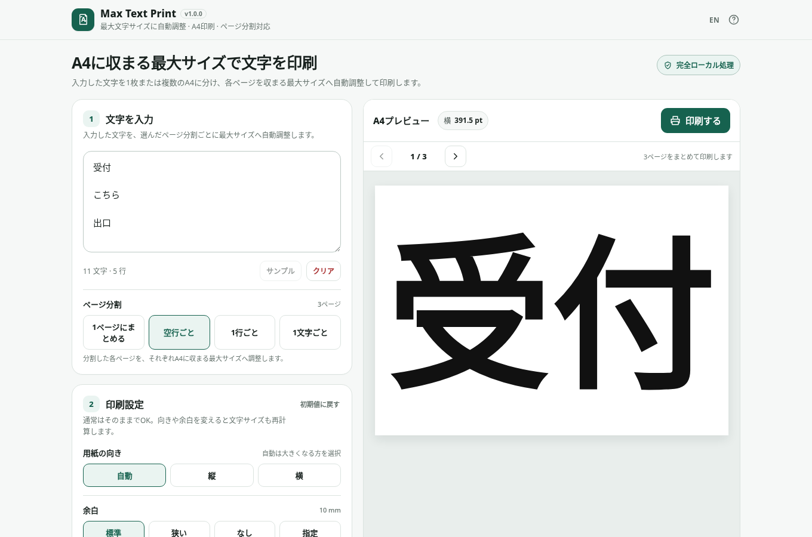

# Max Text Print

[](https://github.com/ttomohisa/htmlapps-max-text-print/actions/workflows/deploy-pages.yml)
[](LICENSE)
[](https://ttomohisa.github.io/htmlapps-max-text-print/)

[English README](README.md)

入力した文字をA4に収まる最大サイズへ自動調整し、必要なら複数ページへ分割して、そのままブラウザから印刷できる単一HTMLアプリです。

## 🚀 デモ

### [GitHub PagesでMax Text Printを開く](https://ttomohisa.github.io/htmlapps-max-text-print/)

GitHub Pagesから最初のHTMLを読み込んだ後、文字サイズの計算、ページ分割、プレビュー、印刷レイアウトは端末内で処理されます。入力した文字がアプリからサーバーへ送信されることはありません。

[](https://ttomohisa.github.io/htmlapps-max-text-print/)

## 主な機能

- **A4に収まる最大サイズへ自動調整** — 文字を入力すると、選択した安全余白の内側に収まる最大フォントサイズを自動計算します。
- **1つの入力を複数枚へ分割** — 1ページにまとめる / 空行ごと / 1行ごと / 1文字ごと、から選べます。
- **各ページを個別に最大化** — 短いページと長いページで、それぞれA4に収まる最大サイズを計算します。
- **印刷前にページ確認** — ページ番号と「移動」またはEnterで直接移動できます。前へ / 次へ、キーボードの左右キーも使えます。
- **まとめて1回で印刷** — 生成したA4ページをすべて、ブラウザ/OS標準の1回の印刷画面へ渡します。
- **実用的な印刷設定** — 縦 / 横 / 自動、10 mm / 5 mm / 0 mm / カスタム余白、端末内の書体、太字、配置、文字色・背景色、行間、文字間隔、縁取りを調整できます。
- **アカウントなしで設定を保持** — ブラウザ保存が使える場合は入力文字と印刷設定を端末内へ保存します。初期値へ戻した直後はトーストから元に戻せます。
- **完全ローカル処理** — 実行時のCDN、API、解析、テレメトリ、外部フォントを使わず、CSPで `connect-src 'none'` に制限しています。
- **単一HTML・日本語/英語対応** — 1つのHTMLに日英UIを含み、スマートフォンでは「文字 / 設定 / 確認 / 印刷」の下部ナビを利用できます。

## すぐに使う

### Webで使う

[デモを開く](https://ttomohisa.github.io/htmlapps-max-text-print/)だけで利用できます。インストールやアカウント登録は不要です。

### オフライン用の単一HTMLを作る

1. このリポジトリをダウンロードまたはクローンします。
2. Windowsで `build-standalone.bat` をダブルクリックします。
3. 生成された `dist/index.html` を必要な場所へコピーします。
4. 以降はそのHTML単体を、インターネット接続やローカルWebサーバーなしで開けます。

v1.0.0ではアプリ本体にランタイム依存がないため、ビルド時に追加パッケージを取得する必要はありません。`DecompressionStream` 対応ブラウザ向けに、より小さい `dist/index.self-extract.html` も生成します。生成された `dist/` はGit管理せず、GitHub PagesとCIでソースから再生成します。

## 使い方

1. 印刷したい文字を入力または貼り付けます。
2. 必要なら **ページ分割** を選びます。
   - **1ページにまとめる** — 全文を1枚へ収めます。
   - **空行ごと** — 空行をページ区切りとして使います。
   - **1行ごと** — 空でない各行を1枚ずつ印刷します。
   - **1文字ごと** — 空白を除く各文字を1枚ずつ印刷します。
3. 複数ページの場合は1〜総ページ数の整数を入力し、**移動** または **Enter** で直接移動できます。**前へ / 次へ** でも確認できます。フォームへ入力しておらず、ヘルプが閉じているときは `←` / `→` キーでも移動できます。
4. 必要なら用紙向き、余白、書体、色、詳細設定を調整します。
5. **印刷する** を押します。生成された全ページが1回の印刷画面へ渡されます。
6. ブラウザ/OSの印刷画面でプリンターを選びます。PDFが必要な場合は **PDFに保存** を選びます。

ページ移動はプレビューだけを変更し、印刷では元の順序ですべてのページを出力します。再計算中、空入力、200ページ上限の超過時は印刷できません。印刷画面が開く前に文字や印刷設定を変更すると待機中の印刷は取り消されます。再計算後にもう一度「印刷する」を選んでください。

### ページ分割と用紙向き

分割した各ページの文字サイズは個別に最大化しますが、用紙向きは印刷ジョブ全体で共通です。**自動**では、生成された全ページを縦・横の両方で評価し、印刷物全体で1つの向きを選びます。ページごとの縦横混在は行いません。

1文字ごとモードでは、対応ブラウザで `Intl.Segmenter` を使い、絵文字や結合文字を途中で分割しないようにしています。誤操作で非常に大きな印刷ジョブを作らないよう、1回に生成できるのは最大200ページです。

### 安全に文字をクリアする

**クリア**の直後は、5秒以内ならトーストの**元に戻す**で復元できます。別のトーストへ切り替わるか、入力・貼り付け・日本語変換を始めるとクリアのUndoは終了し、新しい入力を上書きしません。印刷設定や言語を変更するだけならUndoを続けて使えます。

### 保存された印刷設定を初期値へ戻す

印刷設定は端末内へ保存されます。**初期値に戻す** では、ページ分割、用紙向き、余白、書体、配置、色、詳細設定をまとめて初期状態へ戻します。直後のトーストに **元に戻す** が表示されます。詳細設定だけを戻す小さなリセット操作にもUndoがあります。

## 印刷時の注意

通常のWebページから、ブラウザ・OS・物理プリンター側の設定をすべて強制することはできません。

- 出力が想定より小さい場合は、印刷画面の倍率が100%か確認してください。
- 0 mm余白は、プリンターが用紙端まで印刷できない場合に欠けることがあります。通常利用では初期値の10 mmが安全です。
- 背景色を使う場合、印刷画面で「背景のグラフィック」などを有効にする必要がある場合があります。
- 書体は端末にインストールされたシステムフォントを使います。指定書体がない場合はローカルの代替書体を使うため、端末によって見た目や最大文字サイズが少し変わることがあります。
- 複数ページでも縦または横の向きは全ページ共通です。
- アプリはブラウザ標準の印刷画面を開きます。確認画面を飛ばして直接プリンターへ送ることはできません。

詳しくは [docs/PRINTING.md](docs/PRINTING.md) を確認してください。

## GitHub Pagesで公開する

このリポジトリには、単一HTMLをビルドして `dist/` をGitHub Pagesへ自動公開するワークフローが含まれています。

1. リポジトリ名を `htmlapps-max-text-print` としてGitHubへプッシュします。
2. **Settings → Pages → Build and deployment → Source** で **GitHub Actions** を選択します。
3. `main` へプッシュするか、Actions画面から **Deploy standalone app to GitHub Pages** を手動実行します。
4. ビルド成功後、`https://ttomohisa.github.io/htmlapps-max-text-print/` で利用できます。

ビルド時には、単一HTML、実行時通信の制限、埋め込みfavicon、自己展開版などを検証してから公開します。

## 開発とビルド

```text
.
├─ src/index.template.html       # アプリ本体
├─ app.config.json               # アプリ情報・ビルド設定
├─ dependencies.json             # 内包する依存（v1.0.0ではなし）
├─ dependencies.lock.json        # 依存ロック
├─ build-standalone.bat          # Windows用ビルド入口
├─ build-standalone.ps1          # 単一HTML生成処理
├─ scripts/                      # リポジトリ・ビルド検証
├─ assets/                       # favicon・README画像
└─ dist/
   ├─ index.html                 # 標準の単一HTML
   └─ index.self-extract.html    # gzip自己展開版
```

Windows 10/11では:

```bat
build-standalone.bat
```

リポジトリ全体を検証する場合:

```powershell
powershell.exe -NoLogo -NoProfile -ExecutionPolicy Bypass -File .\scripts\check-repository.ps1
```

リポジトリ全体のチェックにはNode.js 22以上が必要です。依存パッケージ不要の操作回帰テストを、ソース・通常版・自己展開版・ルートのダウンロード用HTMLで実行します。クリアのUndo、入力保存、ページ番号移動、待機中の印刷の取消、ヘルプ表示中のキー操作を検証します。レイアウト、ネイティブのフォーカス、印刷は別途ブラウザで確認してください。

現在のアプリ本体にはnpmのランタイム依存はありません。将来依存を追加した場合に備え、依存更新は自動変更ではなくIssueで確認するワークフローを残しています。

## プライバシーと通信防止

生成HTMLには `connect-src 'none'` を含むContent Security Policyがあります。Max Text Printは実行時API、CDN、アクセス解析、テレメトリ、外部フォントを使用しません。

GitHub Pages版ではページを開くための最初のHTML配信は発生します。その後、入力文字、設定、文字サイズ計算、ページレイアウトはブラウザ内だけで処理されます。ローカルストレージが利用できる場合は入力内容と設定を端末内へ保存します。共有端末で残したくない内容がある場合は、アプリまたはブラウザのサイトデータを削除してください。

ネットワークを完全に切って使う場合は、`dist/index.html` をローカルで開いてください。

## 制限事項

- 印刷倍率、物理的な印刷可能領域、利用可能なプリンターはブラウザ・OS・プリンタードライバー側に依存します。
- アプリで0 mmを選んでも、プリンターがフチなし印刷に対応していなければ用紙端まで印刷できません。
- 背景色は印刷画面で背景グラフィックを有効にしないと印刷されない場合があります。
- システムフォントの有無は端末ごとに異なるため、改行位置や最大文字サイズが完全には一致しない場合があります。
- 自動向きは印刷ジョブ全体で1つの向きを選び、縦横混在には対応しません。
- 1回に生成できるのは最大200ページです。
- `Intl.Segmenter` 非対応ブラウザでは、1文字ごとモードをUnicodeコードポイント単位で分割します。
- 自己展開版HTMLには `DecompressionStream` が必要です。非対応ブラウザでは `dist/index.html` を利用してください。

## 使用ライブラリ

Max Text Print v1.0.0にはサードパーティのランタイム依存はありません。ブラウザ標準APIと端末内のシステムフォントを使用します。詳細は [THIRD_PARTY_NOTICES.md](THIRD_PARTY_NOTICES.md) を確認してください。

## コントリビューション

バグ報告や機能提案はIssueからお願いします。開発への参加方法は [CONTRIBUTING.md](CONTRIBUTING.md) を確認してください。

## ライセンス

Copyright © 2026 ttomohisa

このプロジェクトは [MIT License](LICENSE) で公開されています。
