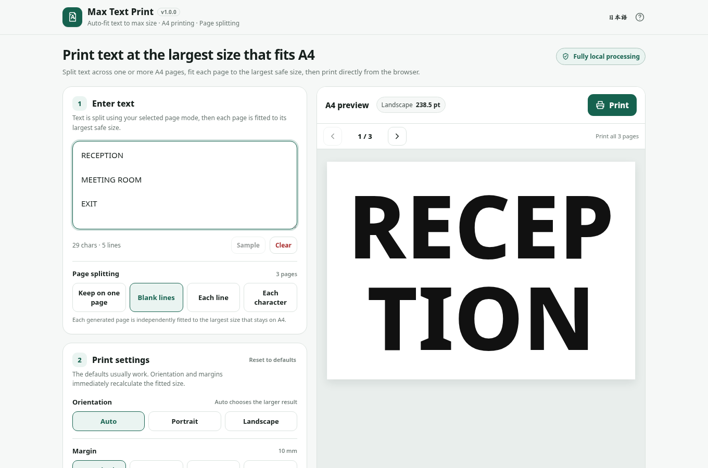

# Max Text Print

[](https://github.com/ttomohisa/htmlapps-max-text-print/actions/workflows/deploy-pages.yml)
[](LICENSE)
[](https://ttomohisa.github.io/htmlapps-max-text-print/)

[日本語版 README](README.ja.md)

A single-HTML browser app that fits entered text to the largest size that stays within A4, with optional multi-page splitting and direct printing from the browser.

## 🚀 Live demo

### [Open Max Text Print on GitHub Pages](https://ttomohisa.github.io/htmlapps-max-text-print/)

GitHub Pages delivers the initial HTML. After it loads, text fitting, page splitting, preview, and print layout are processed locally on your device. Entered text is not sent to a server by the app.

[](https://ttomohisa.github.io/htmlapps-max-text-print/)

## Features

- **Fit text to A4 automatically** — Enter text and the app finds the largest font size that stays inside the selected safe margin.
- **Split one input into multiple sheets** — Keep everything on one page, split at blank lines, put each line on its own page, or print each character on its own page.
- **Fit every page independently** — Short and long page contents each get their own maximum font size.
- **Preview before printing** — Move through generated pages with Previous / Next or the Left / Right arrow keys.
- **Print all pages in one job** — The native browser/OS print dialog receives every generated A4 page together.
- **Choose practical print settings** — Portrait / landscape / Auto, 10 mm / 5 mm / 0 mm / custom margins, local typefaces, bold, alignment, text/background colors, line height, letter spacing, and outline.
- **Keep settings without an account** — Text and print settings are stored locally when browser storage is available. Reset actions can be undone from the toast immediately after use.
- **Fully local processing** — No runtime CDN, API, analytics, telemetry, or remote font is used. Runtime connections are blocked with `connect-src 'none'`.
- **Single HTML and bilingual UI** — Japanese / English are included in the same HTML, with a smartphone layout for Text / Settings / Preview / Print.

## Quick start

### Use the web demo

Just [open the demo](https://ttomohisa.github.io/htmlapps-max-text-print/). No installation or account is required.

### Build a single HTML file for offline use

1. Download or clone this repository.
2. On Windows, double-click `build-standalone.bat`.
3. Copy the generated `dist/index.html` wherever you need it.
4. Open that single file later without an internet connection or local web server.

The build has no runtime package to download in v1.0.0. It also generates `dist/index.self-extract.html`, a smaller gzip self-extracting variant for browsers that support `DecompressionStream`. Generated `dist/` files are intentionally not committed; GitHub Pages and CI rebuild them from source.

## Usage

1. Enter or paste the text you want to print.
2. If needed, choose **Page splitting**:
   - **Keep on one page** — fit the complete input on one sheet.
   - **Blank lines** — use blank lines as page separators.
   - **Each line** — print each non-empty line on its own sheet.
   - **Each character** — print each non-whitespace grapheme on its own sheet.
3. Check generated pages with Previous / Next. When focus is not in a form field and Help is closed, `←` / `→` also moves through the preview.
4. Adjust orientation, margin, typeface, color, or advanced settings if needed.
5. Choose **Print**. All generated pages are sent to one native print dialog.
6. Select a printer, or choose **Save as PDF** when you need a PDF file.

### Page splitting and orientation

Every generated page is fitted independently, but the paper orientation is shared by the whole print job. **Auto** evaluates portrait and landscape across the generated pages and chooses one orientation for the job; mixed portrait/landscape pages are intentionally not produced.

Character-per-page mode uses `Intl.Segmenter` when available so emoji and combining characters are not split in the middle. The app limits one operation to 200 generated pages to avoid accidental very large print jobs.

### Clearing text safely

**Clear** offers **Undo** for five seconds, until another toast replaces it or you begin typing, pasting, or composing text. New input ends Clear Undo so earlier text cannot overwrite it. Changing print settings or language alone keeps Clear Undo available.

### Resetting saved print settings

Print settings are saved locally. **Reset to defaults** restores page splitting, orientation, margin, typeface, alignment, colors, and advanced settings. The toast shown immediately afterward includes **Undo**. Advanced settings also have their own smaller reset action with Undo.

## Printing notes

A normal web page cannot fully force browser, operating-system, or physical-printer settings.

- If output is unexpectedly small, check that print scaling is 100%.
- A 0 mm margin can be clipped by printers that cannot print to the physical edge. The 10 mm default is safer for general use.
- Colored backgrounds may require enabling **Background graphics** or a similarly named print option.
- The app uses fonts installed on the current device. If a named font is unavailable, a local fallback is used, so appearance and fitted size can vary slightly between devices.
- All generated pages use one shared portrait or landscape orientation.
- The app opens the native print dialog; it cannot silently bypass that dialog and print directly.

See [docs/PRINTING.md](docs/PRINTING.md) for implementation details and limitations.

## Publish with GitHub Pages

The repository includes a workflow that builds the standalone HTML and deploys `dist/` to GitHub Pages.

1. Push the repository to GitHub as `htmlapps-max-text-print`.
2. Open **Settings → Pages → Build and deployment → Source** and select **GitHub Actions**.
3. Push to `main`, or manually run **Deploy standalone app to GitHub Pages** from the Actions tab.
4. After a successful deployment, the app is available at `https://ttomohisa.github.io/htmlapps-max-text-print/`.

Each build verifies the standalone HTML, runtime-network restriction, embedded favicon, and self-extracting variant before deployment.

## Development and build layout

```text
.
├─ src/index.template.html       # Application source
├─ app.config.json               # App metadata and build settings
├─ dependencies.json             # Embedded runtime dependencies (none in v1.0.0)
├─ dependencies.lock.json        # Pinned dependency lock
├─ build-standalone.bat          # Windows build entry point
├─ build-standalone.ps1          # Standalone HTML builder
├─ scripts/                      # Repository/build verification helpers
├─ assets/                       # Favicon and README screenshots
└─ dist/
   ├─ index.html                 # Readable standalone app
   └─ index.self-extract.html    # Gzip self-extracting app
```

On Windows 10/11:

```bat
build-standalone.bat
```

For the full repository check:

```powershell
powershell.exe -NoLogo -NoProfile -ExecutionPolicy Bypass -File .\scripts\check-repository.ps1
```

The full repository check also runs the dependency-free Node.js interaction regressions (Node.js 22 or newer) against source, both generated variants, and the root download. The tests cover Clear Undo boundaries, saved text, and dialog shortcut isolation; browser QA is still needed for layout, native focus, and printing.

No npm runtime package is currently required by the app. The dependency-update workflow remains in the repository so future pinned dependencies can be reviewed through Issues rather than updated automatically.

## Privacy and runtime network protection

The generated HTML includes a Content Security Policy with `connect-src 'none'`. Max Text Print does not use runtime APIs, CDNs, analytics, telemetry, or remote fonts.

On the GitHub Pages version, the initial HTML request is required to open the app. After that, entered text, settings, fitting, and page layout stay in the browser. Local storage is used for text and settings when available. On shared devices, clear the app/browser site data if you do not want that content to remain.

For use with the network completely disconnected, open `dist/index.html` locally.

## Limitations

- Print scaling, printable hardware margins, and printer availability are controlled by the browser, OS, and printer driver.
- Edge-to-edge printing is not guaranteed even when 0 mm is selected in the app.
- Background colors may not print unless background graphics are enabled in the print dialog.
- System-font availability differs by device, so exact line breaks and maximum fitted sizes can vary.
- Auto orientation selects one orientation for the complete job; mixed orientations are not supported.
- Up to 200 pages can be generated in one operation.
- Browsers without `Intl.Segmenter` fall back to Unicode code-point splitting for character-per-page mode.
- The self-extracting HTML requires `DecompressionStream`; use `dist/index.html` on browsers that do not support it.

## Dependencies

Max Text Print v1.0.0 has no third-party runtime dependencies. It uses browser-native APIs and locally installed system fonts. See [THIRD_PARTY_NOTICES.md](THIRD_PARTY_NOTICES.md).

## Contributing

Bug reports and feature proposals are welcome through GitHub Issues. See [CONTRIBUTING.md](CONTRIBUTING.md) for development guidance.

## License

Copyright © 2026 ttomohisa

Licensed under the [MIT License](LICENSE).
